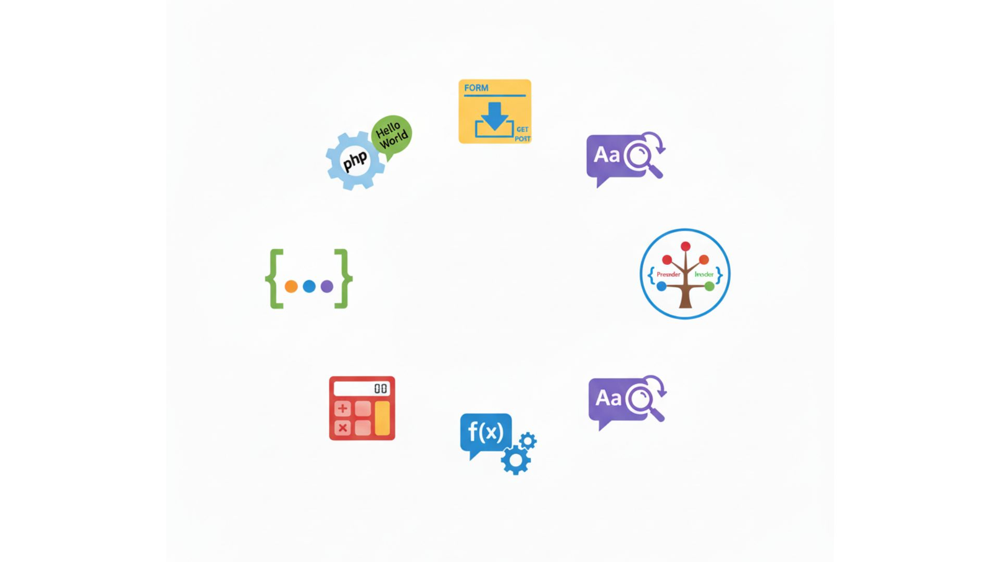

# Taller Práctico de PHP y Desarrollo Web



Este repositorio contiene una serie de ejercicios prácticos diseñados para afianzar los conocimientos en desarrollo web del lado del servidor utilizando PHP, junto con tecnologías fundamentales del frontend como HTML y CSS.


## Puntos del Taller

El taller está compuesto por 7 puntos que abarcan desde conceptos básicos hasta un algoritmo más complejo, permitiendo una formación integral.

1.  **Configuración del Entorno y "Hola Mundo"**: Primeros pasos con PHP, configuración del servidor local y ejecución del primer script.
2.  **Manejo de Formularios y Datos (GET/POST)**: Creación de formularios HTML y procesamiento de los datos enviados en el servidor con PHP.
3.  **Calculadora Básica**: Implementación de una calculadora simple para practicar la lógica de programación y el manejo de operadores en PHP.
4.  **Manipulación de Cadenas (Strings)**: Ejercicios enfocados en funciones para procesar y transformar texto, como contadores de palabras, palíndromos, etc.
5.  **Operaciones con Arrays**: Prácticas sobre la creación, manipulación y recorrido de arrays, un pilar fundamental en PHP.
6.  **Funciones y Modularización**: Creación de funciones personalizadas para reutilizar código y organizar mejor el proyecto.
7.  **Constructor de Árbol Binario**: El punto central del taller. Una aplicación completa que construye y visualiza un árbol binario a partir de sus recorridos (Preorden, Inorden, Postorden). Este ejercicio integra lógica de algoritmos, manejo de datos complejos y una visualización dinámica con CSS.


## Tecnologías Utilizadas

Para la realización de este taller se utilizó un conjunto de tecnologías estándar en el desarrollo web:

* **⚙️ Backend**: **PHP**. Se usó para toda la lógica del lado del servidor, incluyendo el procesamiento de formularios y la implementación del algoritmo de construcción del árbol binario.
* **💻 Frontend**:
    * **HTML5**: Para la estructuración semántica del contenido y los formularios de entrada de datos.
    * **CSS3**: Para el diseño y la maquetación visual de la aplicación. Se utilizó **Flexbox** para la alineación de los nodos del árbol, creando una visualización limpia y responsiva.
* **🔧 Herramientas de Desarrollo**:
    * **Git y GitHub**: Para el control de versiones del proyecto.
    * **XAMPP**: Como entorno de desarrollo local, proveyendo el servidor web Apache y el intérprete de PHP.


## 🚀 Tutorial de Instalación y Prueba

Sigue estos pasos para clonar y ejecutar el proyecto en tu propio equipo.

### Prerrequisitos

* Tener **Git** instalado en tu sistema.
* Tener un entorno de desarrollo local como **XAMPP**, WAMP o MAMP instalado y en ejecución.

### Paso 1: Clonar el Repositorio

Abre tu terminal o Git Bash y clona este repositorio en tu máquina.

```bash
git clone https://github.com/SantOchoa/taller-php.git
```

### Paso 2: Mover el Proyecto al Servidor Local

Mueve la carpeta `taller-php` que acabas de clonar al directorio raíz de tu servidor web. En **XAMPP**, este directorio se llama `htdocs`.

* **Ruta de ejemplo:** `C:/xampp/htdocs/`

### Paso 3: Iniciar el Servidor

Abre el panel de control de **XAMPP** y asegúrate de que el módulo de **Apache** esté iniciado.

### Paso 4: Probar el Proyecto

1.  Abre tu navegador web.
2.  Navega a la URL del proyecto. Suponiendo que el ejercicio del árbol binario es el `punto7`, la URL sería:
    ```
    http://localhost/taller-php/punto7/index.html
    ```
3.  Para probar el constructor de árbol binario, puedes usar los siguientes datos de ejemplo:
    * **Recorrido Preorden**: `A, B, D, E, C`
    * **Recorrido Inorden**: `D, B, E, A, C`
4.  Haz clic en el botón "Construir Árbol" y deberías ver la representación visual del árbol generado.
